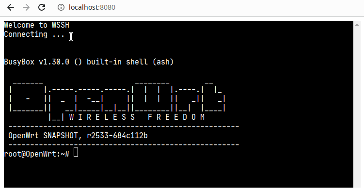

# wssh

[](https://github.com/lanseyujie/wssh/actions/workflows/go.yml)

wssh is an ssh to websocket bridge that lets you invoke a remote shell using nothing but HTTP.


## Screenshot




## Install

```shell
go install github.com/lanseyujie/wssh/cmd/wssh@latest
```


## Usage

```shell
-P int
    ssh port (default 22333)
-h string
    ssh host (default "localhost")
-help
    this help
-i string
    private key file path
-l int
    web listen port (default 8022)
-p string
    ssh or private key password
-u string
    ssh user (default "root")
```
